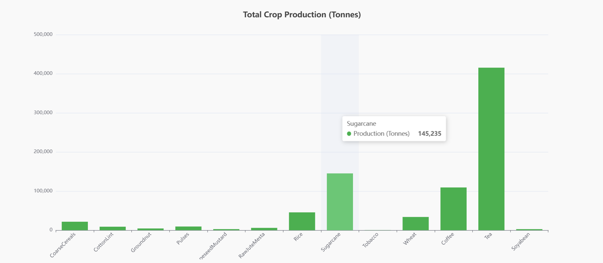
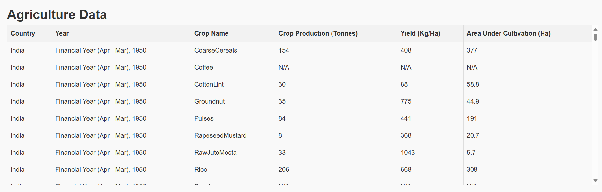

# Crop Data Visualization

This project visualizes crop data using interactive charts and tables. It displays crop production, yield, and cultivation area data in a bar chart and a scrollable table. The dataset is loaded from a JSON file (`dataset.json`).

## Project Setup

Follow the steps below to set up and run the project:

### Prerequisites

Before starting, make sure you have the following installed on your system:

- [Node.js](https://nodejs.org/) (version 14 or later)
- [npm](https://www.npmjs.com/) (npm comes with Node.js)

### 1. Clone the repository

Clone the repository to your local machine using the following command:

2. Install dependencies
Navigate to the project directory and install the required dependencies:

cd crop-data-visualization
npm install

3. Add your dataset
Place your dataset.json file inside the public directory of the project. This file should contain the crop data you want to visualize.

4. Run the project
Start the development server:
npm run dev

Visit http://localhost:3000 in your browser to view the application.

How It Works
The Bar Chart visualizes total crop production (in tonnes) by crop type.
The Table displays detailed crop data, including crop name, production, yield, and area under cultivation. The table is scrollable to handle large datasets.

Example Images
1. Bar Chart Showing Crop Production
2. Scrollable Table Showing Crop Data

Technologies Used
React - Frontend library
ECharts - Charting library
Mantine - UI library for React
Vite - Development server and build tool

License
This project is licensed under the MIT License - see the LICENSE file for details.

### Explanation of the Sections:
1. **Project Title and Description**: Describes what the project is about.
2. **Prerequisites**: Lists software requirements to run the project (Node.js and npm).
3. **Instructions**:
   - How to clone the repository
   - How to install dependencies using `npm install`
   - How to add the `dataset.json` file
   - How to run the project using `npm run dev`
4. **How It Works**: Describes the two main features: the Bar Chart and the Scrollable Table.
5. **Example Images**: Shows how to include images. These images should be placed in the `images` folder within your project directory.
6. **Folder Structure**: A guide to the file organization of the project.
7. **Technologies Used**: Lists the main technologies used in the project (React, ECharts, Mantine, Vite).
8. **License**: Indicates the project license type (MIT License).

Output of code 

1. Bar Chart Showing Crop Production

#### 2. Scrollable Table Showing Crop Data

This `README.md` file provides a complete guide to setting up, running, and understanding the project.

